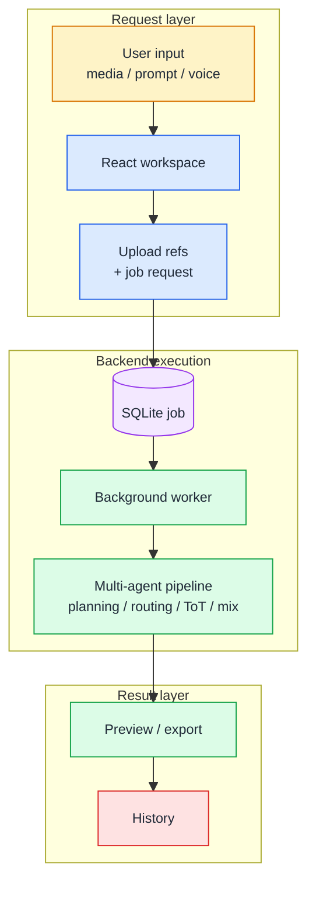
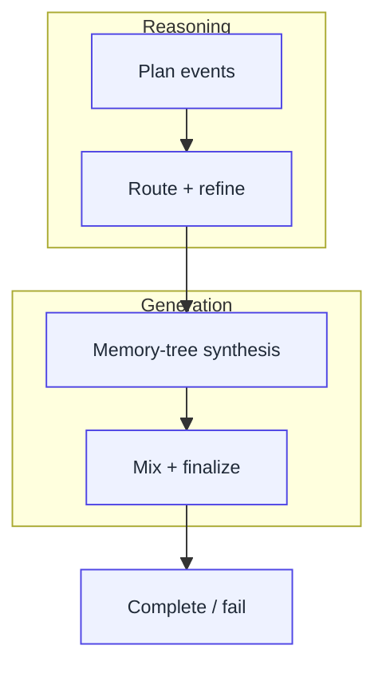
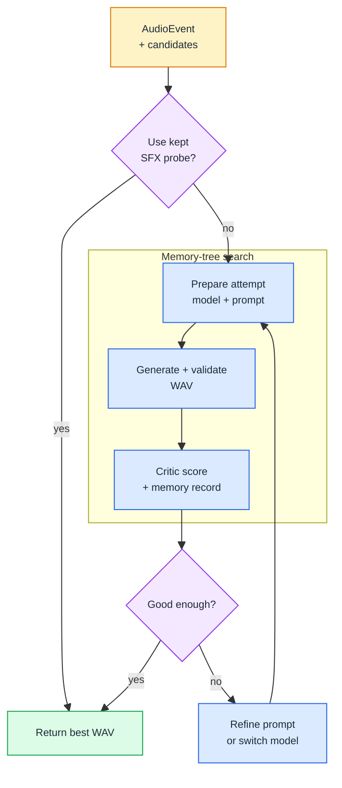
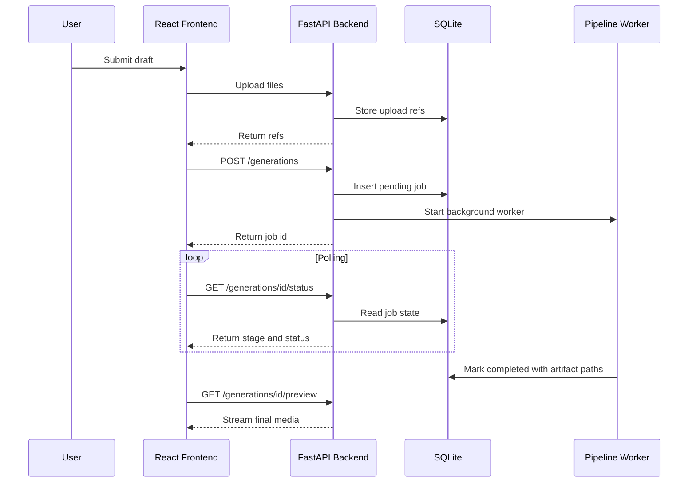

# DubMaster Implementation Report

## Shipping a Training-Free Multi-Agent Audio Generator

DubMaster is our release-style project for turning a video, image, or text prompt into a layered audio result. Instead of fine-tuning a single model, we built the system as a training-free multi-agent pipeline: one part plans the sound events, another part routes them to domain experts, another part generates and critiques candidates, and the final part mixes everything back onto a shared timeline.

The final product is split into two main layers:

- A React frontend where users upload source material, choose audio categories, monitor generation, preview results, and export history items.
- A FastAPI backend that stores jobs, runs the multi-agent audio pipeline, manages uploaded files, and serves generated audio or video artifacts.

At a high level, the release works like this:

<div style="width: 100%; margin: 0 auto;">


</div>

## Frontend

The frontend is a Vite + React + TypeScript application under `src/`. We designed the visible product around three user-facing views: Home, Workspace, and History. The codebase still has processing-state components and status handling, but in the actual release this processing page is hidden from the main user experience. The top-level coordinator is `App.tsx`, which keeps the current view, generation settings, local history, active generation state, and notification banner state.

The main frontend design choice was to keep the user flow linear, even though the backend pipeline is complex. From the user's point of view, the process is:

1. Add a video, image, text prompt, or reference voice.
2. Select one or more output classes: sound effects, speech, background music, or song.
3. Start a generation job.
4. Let the backend run while the app tracks status internally.
5. Review the completed artifact in History.

### Workspace: collecting the job request

`Workspace.tsx` owns the draft generation form. It tracks local files, speech target text, prompt text, selected output classes, and target duration. We separated this page into smaller components so each part has one job:

- `UploadSection.tsx` handles video, image, prompt, reference voice, and speech text input.
- `OutputConfigSection.tsx` handles output category selection and duration.
- `JobSummarySection.tsx` gives the user one final place to inspect and submit the request.

We do not send raw files directly inside the generation payload. The frontend uploads each selected file first and receives a backend reference:

```ts
if (draft.videoFile) {
  const videoUpload = await uploadVideo(draft.videoFile);
  payload = { ...payload, videoRef: videoUpload.ref };
}
```

This keeps the generation request small and lets the backend resolve file references into local paths before starting the pipeline.

### API service layer

All network calls live in `src/services/api.ts`. This gave us one place to define the backend base URL, request error handling, upload helpers, generation creation, status polling, preview URLs, and export requests.

The polling loop is intentionally simple:

```ts
while (Date.now() - startedAt < DEFAULT_POLL_TIMEOUT_MS) {
  const result = await apiRequest<GenerationResponse>(`/generations/${id}/status`);
  onStatusUpdate?.(result);

  if (result.status === 'completed' || result.status === 'failed') {
    return result;
  }

  await new Promise((resolve) => setTimeout(resolve, DEFAULT_POLL_INTERVAL_MS));
}
```

This matches the backend model: a generation job is inserted quickly, then a background worker updates its status and stage. The frontend only needs to poll the status endpoint and render whatever stage is current.

### Hidden processing state

The backend exposes stages such as `planning`, `assigning`, `synthesizing`, and `mixing`; the frontend still maps those updates into active generation state. In the actual visible version, however, the dedicated Processing page has been hidden, so we should treat it as internal implementation support rather than a major user-facing view.

This hidden status layer still matters because audio generation can take a long time. It lets us keep track of the current backend stage, show notices, and decide when a completed artifact should be moved into History:

- Stage 1: Planning
- Stage 2: Expert Routing
- Stage 3: Synthesis and Mix

The key point is that progress exists as application state, not as a visible standalone page in the current release.

### History, preview, and export

Completed artifacts are stored in browser local storage through `historyService.ts`. We chose local history because this project does not include accounts or a user database. The backend stores generation records and file paths, while the frontend keeps a friendly per-browser archive with prompt, source type, render settings, and export metadata.

For live results, `HistoryView.tsx` uses the backend preview endpoint:

```ts
export function getPreviewUrl(id: string): string {
  return `${API_BASE_URL}/generations/${id}/preview`;
}
```

The preview first tries to render as video, then falls back to audio. This supports both video-plus-audio outputs and audio-only generations.

## Backend

The backend is a FastAPI application under `backend/app/`. Its job is to expose a clean API while hiding the heavier multi-agent system in the Python project root.

The backend is made of four main pieces:

- `main.py`: FastAPI app setup, CORS, router registration, health check, and production static serving.
- `routes/upload.py`: upload endpoints for video, image, and reference audio.
- `routes/generations.py`: generation creation, polling, preview, and export endpoints.
- `services/`: storage, SQLite database access, and the generation worker.

### API contract

The request and response shapes are defined with Pydantic in `schemas.py`. The key payload is `GenerationPayload`, which carries the prompt, output class, target duration, optional uploaded file refs, optional speech fields, and frontend render settings.

The backend status model is small by design:

```py
class GenerationStatus(str, Enum):
    PENDING = "pending"
    PROCESSING = "processing"
    COMPLETED = "completed"
    FAILED = "failed"

class GenerationStage(str, Enum):
    UPLOADING = "uploading"
    PLANNING = "planning"
    ASSIGNING = "assigning"
    SYNTHESIZING = "synthesizing"
    MIXING = "mixing"
    DONE = "done"
```

This is the bridge between backend execution and frontend progress display.

### Upload and storage

Uploads are saved by `StorageService`. Each file gets a generated `ref_...` ID and is written to an upload directory. The ref, original filename, and local filepath are stored in SQLite.

The generation route then resolves refs before starting the pipeline:

```py
if payload.videoRef:
    video_path = storage_service.get_filepath(payload.videoRef)
if payload.imageRef:
    image_path = storage_service.get_filepath(payload.imageRef)
if payload.referenceAudioRef:
    reference_audio_path = storage_service.get_filepath(payload.referenceAudioRef)
```

This keeps the API clean: frontend talks in refs, backend talks in file paths.

### Job database

We used SQLite for a lightweight project database. `database.py` creates two tables:

- `generations`: job status, stage, artifact metadata, output paths, errors, and prompt.
- `uploads`: uploaded file references and paths.

SQLite is enough for the release/demo scope because jobs are run by one backend process and the schema is simple. The service enables WAL mode and foreign keys on each connection.

### Background generation worker

The important backend implementation is `GenerationService`. When `/generations` receives a request, it creates a job row immediately and starts the real pipeline in a daemon thread:

```py
thread = threading.Thread(
    target=self._pipeline_worker,
    args=(job_id, prompt, video_path, image_path, llm_name, ...),
    daemon=True,
)
thread.start()
```

That keeps the HTTP request fast. The frontend receives a job ID and begins polling while the worker updates the database.

Inside `_pipeline_worker`, we run the project in four stages.



### Core backend idea

The backend is not only a wrapper around model APIs. Its core idea is to turn audio generation into a structured search problem.

We do not ask one model to directly produce the final soundtrack from a prompt. Instead, we first convert the prompt and media into a typed timeline of `AudioEvent` objects. Each event becomes a smaller task with an audio type, time range, description, volume, candidate models, and model-specific arguments. After that, the backend searches for a good WAV for each event, remembers what went wrong, and mixes the best event-level outputs together.

The current backend therefore has three algorithmic layers:

- Planning layer: convert multimodal input into a timeline.
- Expert layer: turn generic events into domain-specific model calls.
- Memory-Tree synthesis layer: generate, evaluate, revise, and select audio candidates.

This is the central reason the project is training-free. We use frozen LLMs and frozen audio generators, then add coordination logic around them.

### Stage 1: planning

The planner lives in `agents.py`. It asks a multimodal LLM to inspect text, image, and video inputs, then produce structured audio events. Each event includes type, object, start time, end time, description, and volume.

The result is normalized into the dataclasses in `plan.py`:

```py
@dataclass
class AudioEvent:
    audio_type: str
    start_time: float
    end_time: float
    description: str
    volume_db: float = -6.0
    object: Optional[str] = None
    model_candidates: list[str] = field(default_factory=list)
    refined_inputs: Dict[str, Any] = field(default_factory=dict)
```

We also added a hard constraint pass in the backend. Even if the LLM ignores a soft hint, `_enforce_user_constraints()` filters events to the selected output class and clamps event timing to the requested duration. If filtering removes everything, the backend creates a fallback event so the job still has a useful path forward.

The planning prompt is intentionally strict because downstream code depends on a parseable event list. The actual prompt is longer, but the template looks like this:

```text
System:
You are a multimodal audio planning expert.

User:
Analyze all given inputs (video, images, text, or their mix) and identify
every distinct audio event implied.

For each audio event, determine:
- audio_type: one of "speech", "sound effect", "music", "song"
- Object
- start_time
- end_time
- duration
- description
- volume

Output only a structured JSON-style plan:
audio_seg=[
  {
    "audio_type": "Sound effect",
    "Object": "Footstep",
    "start_time": "2",
    "end_time": "7",
    "duration": "5",
    "description": "Footsteps in the forest, light gravel crunch, moderate pace.",
    "volume": -2
  }
]
```

Then we append user constraints such as selected output class, target duration, and exact speech text. The planner treats those constraints as hints; the backend constraint pass treats them as rules.

### Stage 2: expert routing

After planning, `GenerationTeam.assign_and_refine()` routes each event to a domain expert in `experts.py`:

- `SFXExpert` handles sound effects. It can receive video or text input, and generate sound effects with or without video conditioning.

    It prefers video-conditioned model when a source video is available, runs a generation, and decides whether to keep the generation or fall back to text-only SFX generation. This process can be seen as a probe: we test the video-conditioned model's ability to capture on-screen SFX, then decide whether to keep it or switch to a text-only model for that event.

    Here, we use MMAudio as the core model.

- `SpeechExpert` handles speech and voice cloning. It receives the reference voice, obtains the prompt transcript automatically, and respects the user's target utterance. The generated audio is implemented with the SOTA CosyVoice3 model.

- `MusicExpert` handles instrumental **background music**. It converts each music event into a concise style prompt, chooses a musical section label such as intro or verse, and prepares InspireMusic inputs. The result is a piece of music that fits the scene and timing but does not have lyrics.

- `SongExpert` handles lyric-timed song generation. It asks the LLM to write an LRC file, creates a reference style prompt, and prepares DiffRhythm inputs for vocal music.

Each expert converts a general event into model-specific inputs. This keeps Stage 1 simple: the planner only needs to describe what should happen, while Stage 2 decides how each event should be synthesized.

For video-conditioned sound effects, `SFXExpert` can run a probe with MMAudio, ask the LLM whether to keep it, and split remaining sound effects into residual text-only events. This gives us a practical shortcut: when a video-conditioned model already captures the main on-screen sound, we do not regenerate that segment unnecessarily.

The SFX probe reviewer uses another small LLM template. It receives the original SFX plan and a generated video-with-audio preview, then decides whether the probe is good enough to reuse:

```text
System:
You are an audio SFX planning reviewer.
Given:
(a) a video-with-audio MP4 generated by a video-conditioned SFX model
(b) the original Stage-1 SFX plan

Tasks:
1. Decide KEEP or DISCARD for this generated result.
2. If KEEP, produce a revised SFX plan where covered on-screen SFX are
   merged into one consolidated event.
3. Keep residual off-screen or implicit SFX as separate text-only events.

Return JSON only:
{
  "decision": "KEEP" | "DISCARD",
  "merged_video_event": [...],
  "residual_events": [...]
}
```

This probe step is important because video-conditioned sound effects behave differently from text-only sound effects. If the video model already captures the timing of the visual scene, keeping it preserves synchronization and saves search budget.

#### How to implement the experts

The experts do not run heavy neural models directly inside FastAPI. Most audio models need GPU acceleration, so we deploy or reuse them as Hugging Face Spaces and call them through API wrappers.

The implementation has three layers:

1. The expert prepares model-specific arguments. For example, `SFXExpert` builds MMAudio arguments with `text`, `video`, `seconds`, and generation parameters; `SpeechExpert` builds CosyVoice arguments with target text, prompt text, and prompt WAV.

3. The adapter calls the Hugging Face Space through the Gradio API, downloads or copies the returned media, converts it when needed, and materializes a local WAV path for the rest of the pipeline.

In simplified form:

```py
tool = tool_library.get("MMAudio")
wav_path = run_tool(tool, {
    "text": event.description,
    "video": source_video_path,
    "seconds": event.duration(),
}, output_wav)
```

This lets each expert focus on domain reasoning while the tool layer handles remote execution details such as Space inputs, output files, and audio post-processing.

As for the deployment of a space containing desired models, we refer to the [Gradio documentation](https://gradio.app/docs/#deploying-to-hugging-face-spaces) and [CosyVoice3 space demo](https://huggingface.co/spaces/FunAudioLLM/Fun-CosyVoice3-0.5B) for reference. Typically, a space only requires three parts: a builder script with a requirements file to set up the environment, a Gradio interface to handle API calls, named as `app.py`, and the model files with loading code inside. Space deployment is straightforward, and Hugging Face provides generous free GPU resources for public spaces, which is ideal for our training-free multi-agent system.

### Stage 3: Tree-of-Thought synthesis with memory

The synthesis loop lives in `tot.py`, supported by `tree_memory.py`. This is the core backend algorithm. We call it Memory-Tree-of-Thought because it combines a tree-shaped retry structure with a memory module shared across candidate models.

For each event, the system tries candidate models, evaluates generated audio, records scores and suggestions, and revises prompts when needed. The output of this stage is not just a WAV file; it is also a snapshot of the explored nodes and memory records, which helps us debug why a certain candidate won.

The memory tree remembers:

- which model was tried,
- which arguments were used,
- what scores it received,
- what suggestions the critic produced,
- and which node led to the best result.

The current data unit is `NodeRecord`:

```py
@dataclass
class NodeRecord:
    node_id: str
    model: str
    attempt: int
    node_type: str
    parent_id: Optional[str]
    text_used: str
    args_used: Dict[str, Any]
    scores: Dict[str, float]
    suggestions: List[str]

    @property
    def weighted_score(self) -> float:
        return sum(self.scores.get(k, 0.0) * w for k, w in SCORE_WEIGHTS.items())
```

`TreeMemory` can return three useful views of the search:

- `path_history`: the current node's ancestor chain.
- `global_best`: the best scored record in the whole event search.
- `all_suggestions`: deduplicated critic suggestions from every attempt.

That memory context is sent back into the LLM when we refine a prompt. In other words, the next attempt does not only know the immediately previous failure; it can see the best attempt and every useful warning so far.

The search flow is:



There are four details that make this better than a simple retry loop.

First, refinements form an actual chain. A refinement node points to the previous attempt, so `path_history` can reconstruct how the prompt changed over time.

Second, scoring is weighted. Alignment has the largest weight because sound that is beautiful but detached from the scene is still wrong for dubbing. The weighted score is:

```text
weighted_score = 0.50 * alignment + 0.35 * quality + 0.15 * aesthetics
```

Third, the system can abandon a model early. If two attempts from the same model do not improve the weighted score, the loop switches to the next candidate instead of spending all retry budget on a weak direction.

Fourth, cross-model memory avoids cold starts. When a new model begins, `_prewarm_initial_args()` uses suggestions collected from previous models to write a better first prompt for the next model.

### LLM templates used by the core algorithm

The Memory-Tree loop depends on three LLM templates: critic scoring, prompt refinement, and cross-model prewarming.

The critic template evaluates generated audio against the event:

```text
System:
You are an audio critic. Evaluate the following audio on quality,
alignment to the described event, and overall aesthetics.
Return JSON like:
{
  "quality": 0.7,
  "alignment": 0.6,
  "aesthetics": 0.5,
  "suggestions": ["..."]
}

User:
{ event JSON }

Media:
{ generated wav file }
```

The prompt refinement template rewrites only the text field. It does not rebuild the whole tool call, which keeps the generated arguments stable:

```text
System:
You are an audio prompt refining assistant.
Given the previous generation arguments and the full exploration history,
rewrite ONLY the text prompt to better match the described scene and timing.
Learn from all past attempts and suggestions to avoid repeating mistakes.
Return JSON with one field: {"text": "..."}.

User JSON:
{
  "model": "...",
  "current_args": {...},
  "event": {
    "audio_type": "...",
    "Object": "...",
    "description": "...",
    "start_time": "...",
    "end_time": "...",
    "duration": "..."
  },
  "memory_context": {
    "path_history": [...],
    "global_best": {...},
    "all_suggestions": [...]
  },
  "refinement_focus": "FOCUS on ...",
  "requirements": [
    "Keep structure unchanged; revise only the text field.",
    "Respect timing/duration and scene realism.",
    "Avoid generic terms; add concrete acoustic details.",
    "Learn from all past attempts in memory_context.",
    "Pay special attention to the refinement_focus instruction."
  ]
}
```

The refinement focus is chosen from the weakest score dimension:

```py
_FOCUS_HINTS = {
    "alignment": "FOCUS on temporal precision and semantic match with the event's described start/end time and object.",
    "quality": "FOCUS on acoustic clarity, sound fidelity, and richness of audio detail.",
    "aesthetics": "FOCUS on stylistic appropriateness and emotional fit with the scene.",
    "general": "Improve overall audio quality, alignment, and aesthetic appeal.",
}
```

The prewarming template runs when we move to a new model after previous attempts already produced suggestions:

```text
System:
You are an audio prompt assistant.
Prior generation attempts with other models have failed.
Write an improved initial prompt for a new model that avoids these known issues.
Return JSON with one field: {"text": "..."}.

User JSON:
{
  "model": "...",
  "current_args": {...},
  "event": {
    "audio_type": "...",
    "description": "...",
    "start_time": "...",
    "end_time": "..."
  },
  "prior_model_suggestions": [...],
  "requirements": [
    "Write a fresh, improved prompt avoiding known failure patterns.",
    "Respect timing/duration and scene realism.",
    "Add concrete acoustic details."
  ]
}
```

The result is a search loop that behaves more like an engineer improving a generation prompt than a script blindly retrying the same call.

### Tool library and model adapters

`tools_v2.py` loads tool definitions from `config.yaml`, expands environment variables, and binds each configured tool to a runtime adapter under `tool/`. The supported adapters include:

- MMAudio for sound effects.
- CosyVoice2 and CosyVoice3 for speech.
- InspireMusic for background music.
- DiffRhythm for song generation.

The backend does not need to know each model's low-level call details. It asks the `ToolLibrary` for a tool by name, and the tool runtime handles the actual generation request.

### Stage 4: mixing and muxing

The final media assembly lives in `mixer.py`. We collect generated WAV files, align them by event start time, apply volume adjustments, and overlay them with `pydub`.

If the source was a video, the mixer muxes the new audio with the original video using MoviePy. If the source was an image, it creates a simple MP4 from the image and generated audio. If there is no visual input, the WAV output is enough.

The completed job stores both paths when available:

```py
self._mark_completed(
    job_id,
    title=f"DubMaster_{job_id[-4:]}",
    art_type=art_type,
    duration=duration_str,
    heights=heights,
    audio_path=final_audio,
    video_path=final_video,
)
```

The frontend can then preview `/generations/{id}/preview` or download from `/generations/{id}/export/download`.

## Frontend and Backend Integration

The full interaction between the two layers is intentionally small:



This division made development easier. The frontend only needs stable API states; the backend can keep improving the generation internals without changing the user flow.

## What We Focused On

We skipped unnecessary complexity such as account systems, cloud object storage, and advanced API-key setup in the user flow. Instead, we focused on the parts that make DubMaster interesting:

- A multimodal planning stage that converts source material into audio events.
- Separate experts for SFX, speech, music, and song.
- A memory-based Tree-of-Thought loop for generation attempts.
- A clean React workflow that makes long-running generation understandable.
- Preview, history, and export features that make the result feel like a usable app rather than only a script.

## Final Result

In this release, we built DubMaster as a full-stack audio generation system. The frontend provides an approachable production-style interface, while the backend coordinates file storage, job state, multi-agent planning, model routing, synthesis, critique, and final mixing.

The main lesson from our implementation is that audio generation becomes easier to control when we do not ask one model to do everything. By splitting the task into planning, expert routing, synthesis, critique, and mixing, we created a pipeline where each stage has a clear responsibility and can be improved independently.
